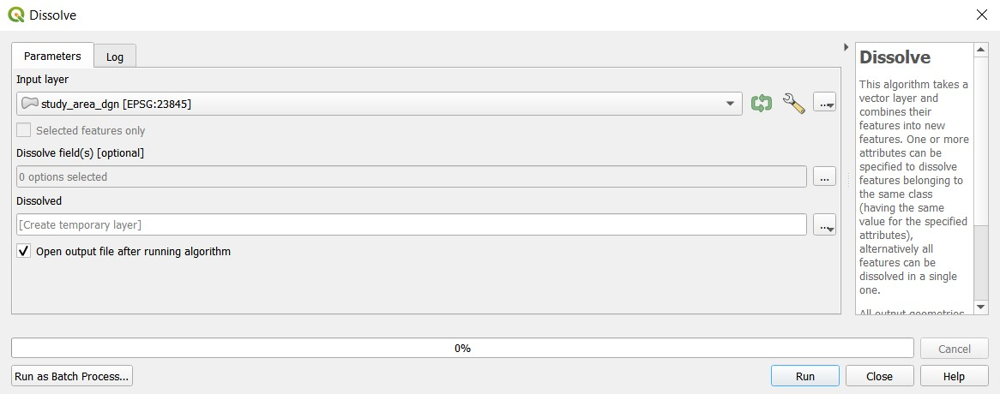
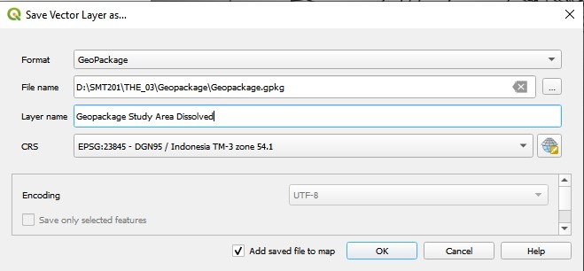
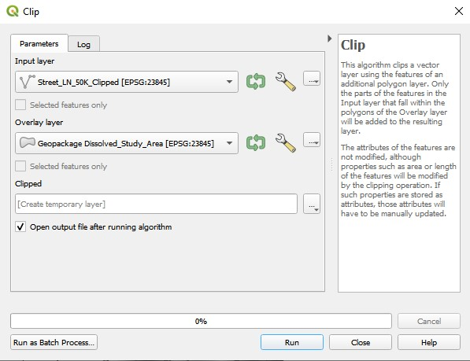
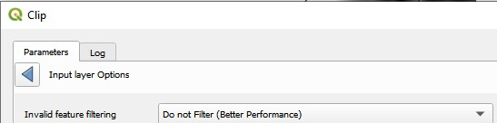

```{r setup, include=FALSE}
knitr::opts_chunk$set(echo = TRUE)
```

# 1.0 Data Source

All of the following datasets were obtained from Indonesia Geospatial.

Name | Description | Link
------------- | ------------- | -------------
BATAS DESA DESEMBER 2019 DUKCAPIL KALIMANTAN TIMUR | Comprehensive Population Data for East Kalimantan | https://drive.google.com/file/d/1aeD6kPAy6Uzzx61Z51mfEI5FQzDCY_kJ/view
KOTA_BALIKPAPAN | Topographic Data for Kota Balikpapan | https://drive.google.com/file/d/1VgxlToSH1auqApEgh_jAW06DKlBy67Bh/view
KOTASAMARINDA | Topographic Data for Kota Samarinda | https://drive.google.com/file/d/12kiqmm_wsyjc2-pqNO2e8TM_c-fMeTAk/view
PENAJAMPASERUTARA | Topographic Data for Penajam Paser Utara | https://drive.google.com/file/d/1SkS3y_pF7avPfvNTft7RK5W3p4fJ2KEr/view
KUTAIKARTANEGARA | Topographic Data for Kutai Kartanegara | https://drive.google.com/file/d/1EfoR3qJEX1qX5d4tUOGFLhEaSxa4Du1o/view
23. Geology Kalimantan Timur | Geological data of East Kalimantan | https://drive.google.com/file/d/1Ke99g1lqXIx2ku2Vy8CBxl62L8Htv3Ce/view
30. Provinsi Kalimantan Timur | DEM digtal elevation model at 30m resolution | https://drive.google.com/file/d/1-LIP45j41T7psyy1gUvJBaj-MSWb9rK1/view
OSM Buildings | Buildings and settlement data | https://drive.google.com/file/d/1iTvLFztIJQfcIxVZ-Tu8CUZevrSbvchO/view
Titik Api Hotspot Seluruh Indonesia | Forest hotspot data from 2014-2019 (Download for years 2018 and 2019) | https://www.indonesia-geospasial.com/2020/04/shapefile-shp-titik-api-hotspot.html

***

# 2.0 Importing data into QGIS

There are some empty layers in the datasets provided, therefore, only the following layers are required, along with their respective translations:

## 2.1	Economic and Business
* LAYANANKESEHATAN_PT_50K: Health_svcs
* RUMAHSAKIT_PT_50K: Hospital_PT
* PUSKESMAS_PT_50K: Public_Health_Center_PT
* PENDIDIKAN_PT_50K: Education_Services_PT
* NIAGA_PT_50K: Commerce_PT
* INDUSTRI_PT_50K: Industry_PT
* PEMERINTAHAN_PT_50K: Govt_PT

## 2.2	Transport and Communication
* JALAN_LN_50K: Street
* AIRPORT_AR_50K: Airport_AR
* AIRPORT_PT_50K: Airport_PT
* JEMBATAN_LN_50K: Bridge_LN
* JEMBATAN_PT_50K: Bridge_PT
* PELABUHAN_PT_50K: Harbour_PT
* JALAN_AR_50K: Transport_InfraAR_50K
* TERMINALBUS_PT_50K: Bus_Terminal
* DERMAGA_PT_50K: Ship_Ports
* MENARATELPON_PT_50K: Phone_Towers

## 2.3	Infrastructure
* LAYANANKESEHATAN_PT_50K: Health_svcs_PT
* RUMAHSAKIT_PT_50K: Hospital_PT
* PUSKESMAS_PT_50K: Public_Health_Center_PT
* PENDIDIKAN_PT_50K: Education_Services_PT
* NIAGA_PT_50K: Commerce_PT
* INDUSTRI_PT_50K: Industry_PT
* PEMERINTAHAN_PT_50K: Govt_PT
* KANTORPOS_PT_50K: Post_Office_PT
* KANAL_LN_50K: Manmade_Canal_LN
* DEPOMINYAK_PT_50K: Fuel_Oil_Terminal_PT
* MENARAEKSPLOITMINYAK_PT_50K: Fuel_Oil_Mining_PT
* KANTORPLN_PT_50K: PLN_Office_PT
* STASIUNRADIO_PT_50K: Radio_Station_PT
* TAMBANG_AR_50K: Mine_AR
* CAGARBUDAYA_PT_50K: Heritage_Buildings_PT
* SPBU_PT_50K: Gas_Station_PT
* GENLISTRIK_PT_50K: Electricity_PT
* GARDULISTRIK_PT_50K: Electrical_Terminal_PT
* SUNGAI_LN_50K: WAter_Grooves_LN
* WADUK_AR_50K: Artificial_Containers_AR
* STASIUNTV_PT_50K: TV_Station_PT
* RAWA_AR_50K: Water_Container_AR
* ARENAOLAHRAGA_PT_50K: Sports_Facilities_PT
* MAKAM_PT_50K: Gravesite_PT
* RUNWAY_AR_50K: Runway_AR
* RUNWAY_LN_50K: Runway_LN
* SARANAIBADAH_PT_50K: Worship_PT
* SOSIAL_PT_50K: Social_Area_PT
* PEMUKIMAN_AR_50K: Settlement_AR
* PELABUHAN_PT_50K: Harbour_PT
* TERMINALBUS_PT_50K: Bus_Terminal_PT


## 2.4	Environment and Hazards
* GARISRPANTAI_LN_50K: Beach_LN
* AGRISAWAH_AR_50K: Wetland_crops_AR
* NONAGRIHUTANBASAH_AR_50K: swamp_AR
* SUNGAI_LN_50K: River_LN
* SUNGAI_AR_50K: River_AR
* EMPANG_AR_50K: Fish_shrimpfarm_AR
* NONAGRISEMAKBELUKAR_AR_50K: overgrown_AR
* NONAGRIALANG_AR_50K: non-arableland_AR
* DANAU_AR_50K: lake_AR
* IRIGASI_LN_50K: irrigation line_LN
* AGRILADANG_AR_50K: dryland crops_AR
* AGRIKEBUN_AR_50K: agriculture_AR
* BENDUNGAN_PT_50K: dam_PT
* KONTUR_LN_50K: contour_LN
* KOLAM_AR_50K: pool_AR
* TAMBAK_AR_50K: pond_AR
* NONAGRIHUTANKERING_AR_50K: forest_AR
* NONAGRIHUTANBASAH_AR_50K: wet forest_AR


Save these layers into a new geopackage named **kalimantan**, naming them in this format: **district_translation**. For example, AGRIKEBUN in the Penajam Paser Utara regency would be named penajam_agriculture. Ensure that the CRS is set to **EPSG:23845 - DGN95 / Indonesia TM-3 zone 54.1** before saving.

***

# 3.0 Extraction of study area

Add in the **Batas_Desa_Desember_2019_Dukcapil_Kalimantan_Timur** layer, and open its attribute table. Click on **select features by expression**.


Use the following expression:

> "KECAMATAN" in ( 'ANGGANA' , 'BABULU' ,  'LOA JANAN' , 'LOA KULU' , 'MARANG KAYU' , 'MUARA BADAK' , 'MUARA JAWA' , 'PENAJAM' , 'SAMBOJA' , 'SANGA SANGA' , 'SEBULU' , 'TENGGARONG' , 'TENGGARONG SEBERANG' , 'SEPAKU' , 'WARU' ) or  "KAB_KOTA" in ( 'KOTA BALIKPAPAN',  'KOTA SAMARINDA' )


Click on select features.

Once the features are selected, right click on the layer and select **Export > Export Selected Features As**. Save in the **kalimantan** geopackage and name this layer **Study_Area_dgn**. Ensure that the CRS is set to **EPSG:23845 - DGN95 / Indonesia TM-3 zone 54.1** before saving.

***

# 4.0 Clipping of layers

There are a few layers that need to be clipped to within our study area.

## 4.1 DEM
Import the DEM raster layer. Click on clip raster by extent under raster → extraction. Set input layer as **DEM SRTM 30M Kalimantan Timur**. Under clipping extent, select calculate from layer, select **Study_Area_dgn**. 


Click on ok. A new clipped raster layer is created.

Save this layer into the Kalimantan geopackage, naming it **dem_clipped**. Ensure that the CRS is set to **EPSG:23845 - DGN95 / Indonesia TM-3 zone 54.1** before saving.

## 4.2 Dissolving of study area

Dissolve layer is similar to union but in this everything is merged by the common field and it works on a single layer. To do that open the tool from **Vector > Geoprocessing Tools > Dissolve**. You assign the **Input Vector layer** on the **Study_Area** and click run. 



Once the output layer is created. Right click on the layer and select Save feature as. Click on save into the **kalimantan** Geopackage and ensure that the CRS is set to **EPSG:23845 - DGN95 / Indonesia TM-3 zone 54.1** before saving.



## 4.3 Clipping of other layers

There are some layers that have data outside of our study area. We need to ensure that all our layers only have information that is within our study area. We will be using the **Clip** function. For this example, I will be using the Street_LN layer under our Penajam folder.
Click on **Vector  → Geoprocessing Tools  → Clip**. Select the **Street_LN layer** as the input layer and **Dissolved Study Area**  as the  **Overlay layer**.



For both the layers, ensure that you have chosen the **Do not filter(better performance)** as the Invalid feature filtering. Click on Run.



A new clipped raster layer is created. Right click on the clipped layer and select **Export and Save features as**. Click on OK. Save this layer into the Kalimantan geopackage, naming it **dem_clipped**. Ensure that the CRS is set to **EPSG:23845 - DGN95 / Indonesia TM-3 zone 54.1** before saving.

Repeat the steps for other layers that have unwanted data points outside our study area, continuing with the naming convention of **original_layer_name_clipped** as the name of the new clipped layer.