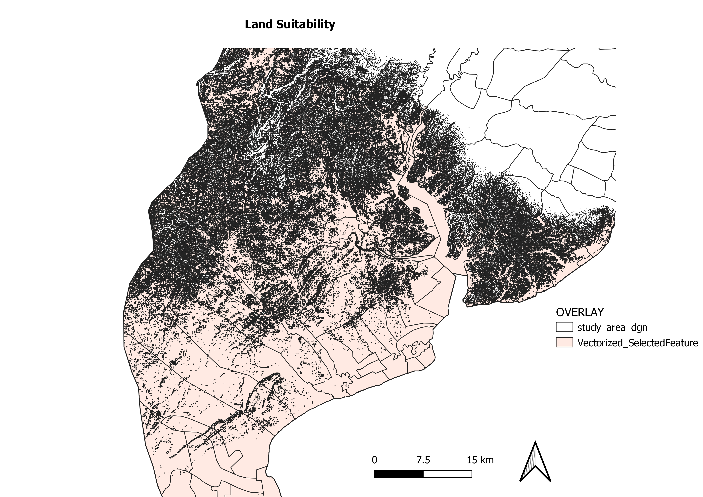
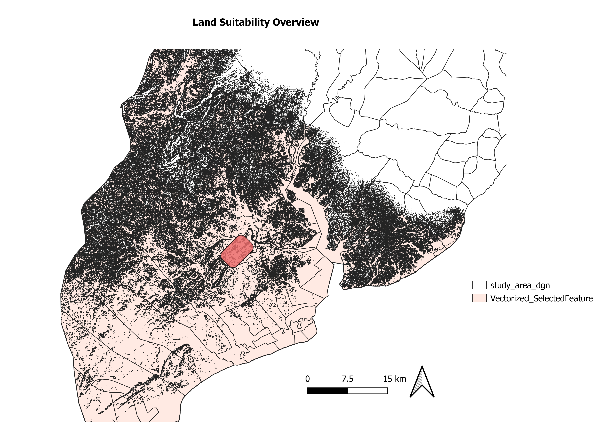
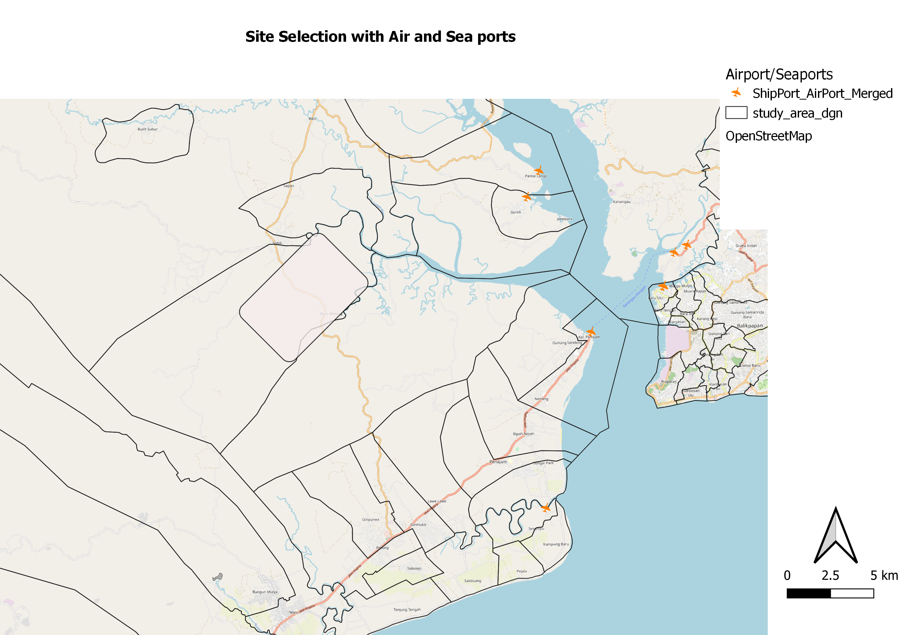
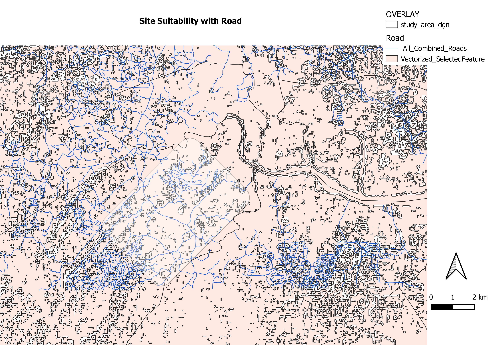
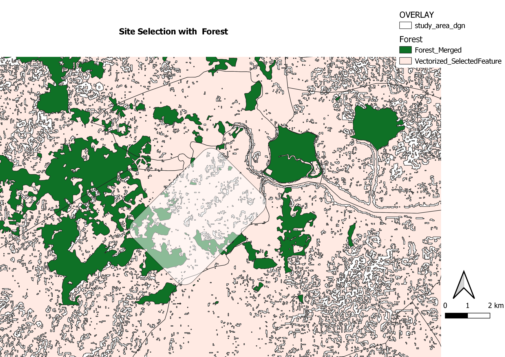
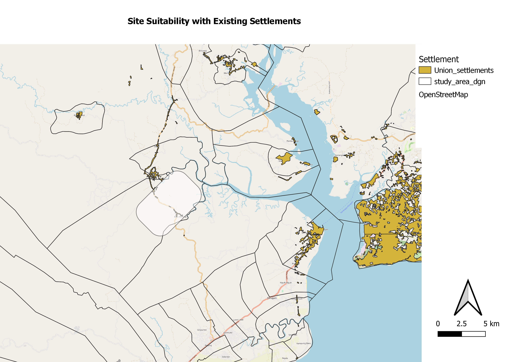

```{r setup, include=FALSE}
knitr::opts_chunk$set(echo = FALSE)
```

# Problem

To propose a suitable site for the relocation of the Indonesian capital. A suitable site would satisfy multiple factors including:

* Size
  + Area between **4500 to 5500** hectares
* Safety
  + Away from potential natural disaster risk areas like **sea coasts** and **major rivers**
  + Not in areas prone to **forest fire**
* Accessibility
  + Highly accessible by **roads**
  + Close proximity to **airports and seaports**
* Ease of development
  + Avoid **steep slopes**
  + Avoid **natural forest**
  + **Near current existing settlement** but not at current major settlement

# Motivation

Jakarta, the sinking city, is experiencing first-hand the effects of **rising sea levels**. Additionally, it also suffers from **overpopulation** that burdens its water piping system. This forces residents to pump water from underground, further lowering the city foundations. A new capital will ease the overcrowding and thus the sinking of the current sea-side capital Jakarta.

# Approach

The following geospatial analysis techniques were used in our project:
**MCDA**, **AHP**, **Reclassification by table**, **Raster Calculator**, **Clipping**, **Polygonizing**, **Rasterize**, **Merging Vector Layer**.

# Analysis

{width=80%}

We decided that the **slope** factor is the most important factor to note when choosing our site. Thus we used the map above as our base map. The areas that are spotty are **steeper than 15 degrees** and thus an area with high concentration of spots would be unfit for our site. We analyzed the area using our four factors mentioned in issue analysis to choose our site.

# Recommendation
{width=80%}


After much consideration, this area that is **shaded in a rectangle** is our recommendation for the new capital city. It is **4723 hectares** in size and while, is not near the major urban settlement in Balikpapan, is near other existing small settlements. This site selection satisfies our size objective since it is between 4500 to 5500 hectares.

{width=80%}


To satisfy our objective of safety, we avoided areas that are **forest fire hotspots** and ensured the recommended location was not along the coast or besides major rivers to avoid flooding.

{width=80%}


{width=80%}


To satisfy our objective of accessibility, the new capital must be **accessible by roads**. In the previous map, Land Suitability Map with Air and Sea Ports we can also see there is a **major highway** running through our site, providing ease of transport. The major highway also connects our site to highways and it is positioned in close proximity to **harbours**.

{width=80%}


{width=80%}


Our chosen site does not overlap much with **heavy forests** and is also near other settlements while not being situated at a major settlement itself. Both of these in conjunction with the slope layer show ease of development for our site.

# Future Plans
In the future, it is possible to expand our scope of issues and factors that contribute to a suitable site. This could include things such as **avoiding agricultural areas** as well as being in **proximity to worship** areas based on local demographics for greater quality of life in the capital. It is also possible to expand our toolkit to use a **3D representation of slope** to get a better understanding of the land layout.


