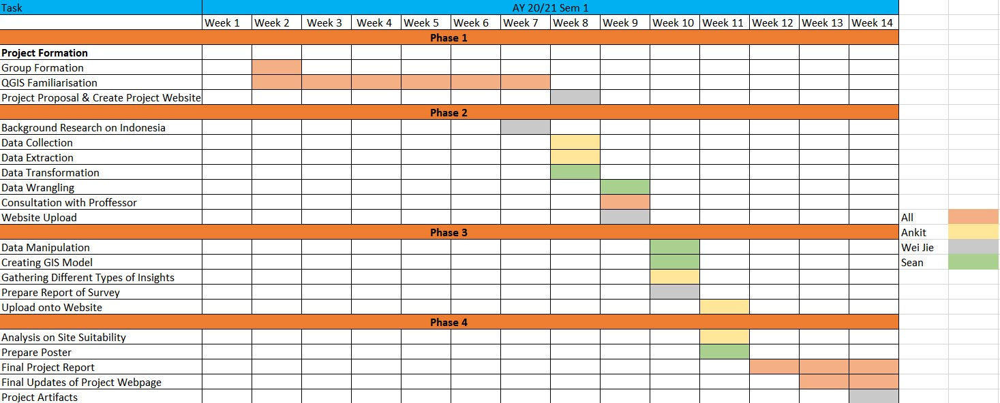

```{r setup, include=FALSE}
knitr::opts_chunk$set(echo = FALSE)
```

# 1.0	Project Motivation

Jarkata, the sinking city, is experiencing first-hand the effects of rising sea levels. Additionally,  it has its own unique problem. The segregation and overpopulation in Jakarta further burden the already uneven water piping system and thus cause a structural restriction of water to most of its residents. This forces them to source water from pumping groundwater. 

With large amounts of groundwater being pumped, the city’s foundations have been lowered with some places sinking over four meters in the last twenty years. Moving the capital and its population with it would ease the strain on the water piping system and thus reduce the need for pumping groundwater, stabilizing the problem. 


Source: The Asean Post

## 1.1	Project Objectives
  
To do a thorough investigation of East Kalimantan with the intention of finding the best location for the new capital. The new location should be sizable, safe, accessible and easy to develop.

## 1.2	Scope

By making use of QGIS software and data gathered from Indonesia Geospasial we plan to analyse each of the previously mentioned categories.

These categories are:

* Sizable
  + Area between 4500 to 5500 hectares

* Safe
  + Away from potential natural disaster risk areas like sea coasts and major rivers
  + Not in areas prone to forest fire

* Accessible
  + Highly accessible by roads
  + Close proximity to airports and seaports

* Ease of development
  + Avoid steep slopes
  + Avoid natural forest
  + Near current existing settlement but not at current major settlements


# 2.0	Project Milestones



# 3.0 References
1. https://www.nbcnews.com/news/world/indonesia-move-capital-sinking-jakarta-borneo-n1046651

2. https://www.vox.com/22295302/why-jakarta-sinking-flooding-colonialism 

3. The Asean Post https://theaseanpost.com/article/indonesias-new-capital-hold-due-pandemic

