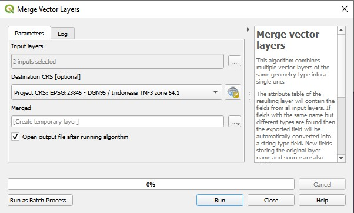
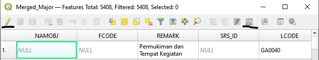
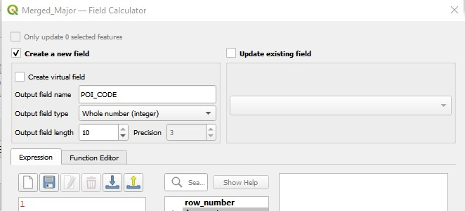
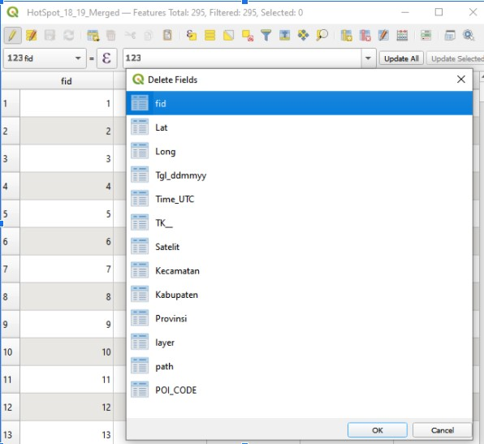
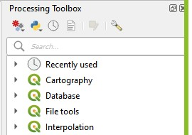
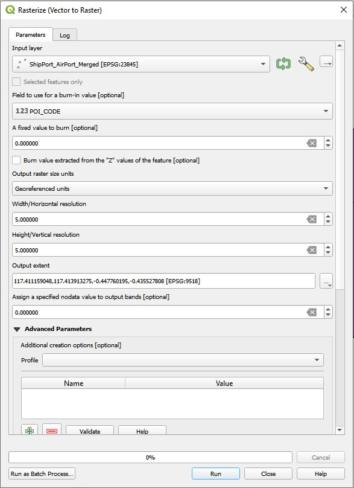
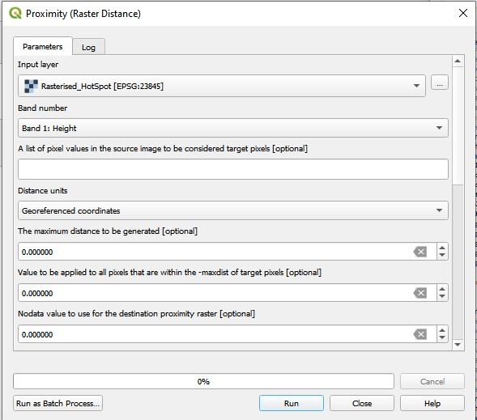
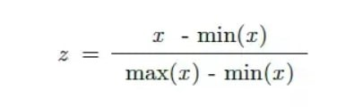
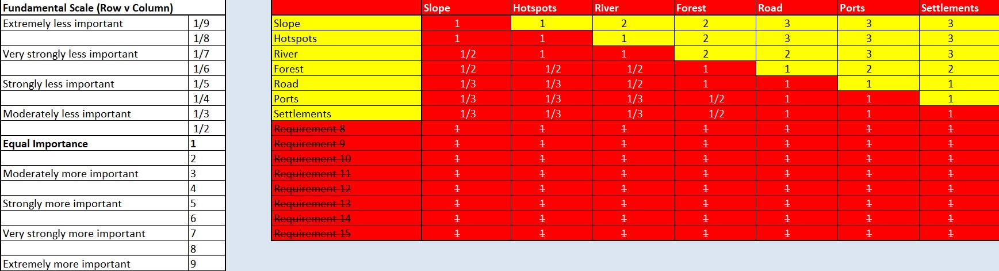
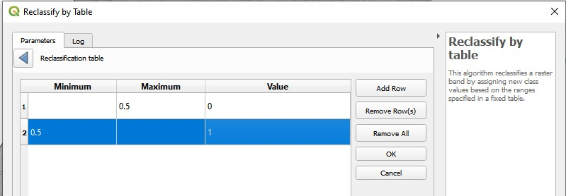

```{r setup, include=FALSE}
knitr::opts_chunk$set(echo = TRUE)
```

# 1.0 Factors for Task 2

For Task 2, we have 5 factors to consider, namely,

* Have a size between 4500-5500 hectares
* Avoid steep slope
* Far away from potential natural disasters such as major rivers
* Near but not at the current major settlement areas
* Avoid natural forest as much as possible
* Avoid areas prone to forest fire
* Highly accessible via road transport
* Near Airports and Seaports

To try to compact this issue as much as possible, we will be combining the layers of airports and seaports, merging the hotspots found from the year 2018 and 2019 as well as merging all the forest layers in the study area.

## 1.1 Merging Layers

In this example, we will merge the two Hotspot layers. The following steps will be reproducible to merge the other layers together. Firstly, ensure that you have the 2 following layers, **“Titik Api Hotspot se-Indonesia Tahun 2018.shp”** and **“Titik Api Hotspot se-Indonesia Tahun 2019.shp”**
Next, go to **Vectors -> Data Management Tools -> Merge Vector Layers**… and choose the 2 hotspot layers as your input layers and run it.



Once the output is created, **right click** on the output layer and select the **open attribute table**. Click on the **pencil icon** on the corner left to toggle editing and select **open field calculator**, which is the 4th icon from the right.



Ensure that the **Create a new field** is checked. Put **POI_Code** as the **Output field name** and **1** as the expression. This column will be used for burn-in values(if any).



Next, select **Delete field**, which is the 6th icon from the right. Select the **fid** field to be deleted. 



Once done, save the changes and save the layer into the kalimantan geopackage, named **HotSpot_18_19_Merged**. Ensure that the CRS is set to **EPSG:23845 - DGN95 / Indonesia TM-3 zone 54.1** before saving.

Repeat these steps to merge all the airports and seaports into 1 layer as well as all the forest within the study area into another layer. Name them **Air_Sea_Ports_Merged** and **Forest_Merged** respectively.

# 2.0 Rasterizing the layers

From the menu bar of QGIS, select **Processing -> Toolbox**.
The processing toolbox pane appears on the right side of the Map View window.



From the Geoprocessing Toolbox, click on **GDAL -> Vector conversion -> Rasterize (vector to raster)**. The dialog window appears. Use the following parameters:

* **Input layer**: HotSpot_18_19_Merged.
* **Field to use for a burn in value**: POI_CODE
* **Output raster size units**: Georeferenced units
* **Width/Horizontal resolution**: 50
* **Height/Vertical resolution**: 50
* **Output extent**, select **Calculate from layer** -> **Geopackaged Dissolved Study Area**
Your Screen should look something similar to the figure below



Click the Run button.
A new raster layer will be created. Using the steps from before, save the raster into the kalimantan geopackage and name it Rasterized_HotSpots. Ensure that the CRS is set to **EPSG:23845 - DGN95 / Indonesia TM-3 zone 54.1** before saving.
Repeat the steps for all the other layers.

# 2.1 Creating proximity layer

From the Processing Toolbox panel, search for **Proximity(raster distance)**, under GDAL. Double click on it. Use the following parameters:
* **Input layer**: Rasterized_HotSpots
* **Distance units**:Georeferenced coordinates
The dialog should look somewhat similar to this.



Click on the Run button.
A new proximity map will be added. To observe how it works, check your hotspot layer and your proximity layer. Zoom into the study area and right click on the proximity layer and select Stretch Using current Extent which will give you a clearer view.
Using the steps from earlier, save this into the kalimantan geopackage and name the layer ***Proximity_Hotspot**.  Ensure that the CRS is set to **EPSG:23845 - DGN95 / Indonesia TM-3 zone 54.1** before saving.
Repeat this process for all the other layers.

# 3.0 Raster-based GIS Multiple-Criteria Decision Making (MCDA)

As all the factors have different scales upon which criteria is measured, it is necessary that factors are standardized before combination using the formula below:



Using the raster calculator, you should be able to derive the factor scores layers for all the layers able.
The dialog should look similar to this.

Repeat these steps for all the factors.

## 3.1 AHP Analysis
Using the excel sheet provided by SBC Associates, list down all the 7 different factors on the rows. We have determined the importance of each factor according to the rating on the left side of the excel sheet as seen here.



Ensure that the consistency check is below 10% for it to be a good evaluation.

Now, we will compute the Land Suitability Layer by using the factor score derived above. Using the raster calculator of QGIS, we will be using this expression:

> "Factorised_Slope@1" * 0.247  + "Factorised_HotSpot@1" * 0.221 + "Factorized_River@1" * 0.192 + "Factorized_Forest@1"*0.115 + "Factorised_Road@1"* 0.083+"Factorised_Port@1"* 0.071  +"Factor_major_settlement

Click on run.

# 4.0 Identifying suitable sites
Once the MCDA model is done, we used a **composite factor score of at least 0.5** to evaluate site suitability, according to many senior planners.To do this, we will open up **Toolbox ->Search for Reclassify by table**. Add 2 tables with binary score of 0 and 1, 1 being suitable and 0 being not suitable, it should look something like this.



Ensure that the **output data type** is **Float32**. Click on run.

The MCDA model should look something like this:

We will then save it as AHP_capitalcity into the kalimantan geopackage. Ensure that the CRS is set to **EPSG:23845 - DGN95 / Indonesia TM-3 zone 54.1** before saving.

## 4.1 Vectorise suitable sites
From the menu bar, select **Raster -> Conversion -> Polygonize(Raster to Vector)**. Use the following parameters:

* **Input Layer**: AHP_capitalcity
* **Name of the field to create**: Sites.
* Ensure that **Use 8-connectedness** is **unchecked**.

Click on run.
A new temporary layer called Vectorized will be added. Save the final layer into the kalimantan GeoPackage. Name it Potential_Capital_Cities. Ensure that the CRS is set to **EPSG:23845 - DGN95 / Indonesia TM-3 zone 54.1** before saving.

