```{r setup, include=FALSE}
knitr::opts_chunk$set(echo = TRUE)
```

# 1.0 Preparing the factors for Task 2

For Task 2, we have 5 factors to consider, namely,

* Have a size between 4500-5500 hectares
* Avoid steep slope
* Far away from potential natural disasters such as major rivers
* Near but not at the current major settlement areas
* Avoid natural forest as much as possible
* Avoid areas prone to forest fire
* Highly accessible via road transport
* Near Airports and Seaports

To try to compact this issue as much as possible, we will be combining the layers of airports and seaports, merging the hotspots found from the year 2018 and 2019 as well as merging all the forest layers in the study area.

## 1.1 Merging Layers

In this example, we will merge the two Hotspot layers. The following steps will be reproducible to merge the other layers together. Firstly, ensure that you have the 2 following layers, **“Titik Api Hotspot se-Indonesia Tahun 2018.shp”** and **“Titik Api Hotspot se-Indonesia Tahun 2019.shp”**
Next, go to **Vectors -> Data Management Tools -> Merge Vector Layers**… and choose the 2 hotspot layers as your input layers and run it.


Once the output is created, **right click** on the output layer and select the **open attribute table**. Click on the **pencil icon** on the corner left to toggle editing and select **open field calculator**, which is the 4th icon from the right.


Ensure that the **Create a new field** is checked. Put **POI_Code** as the **Output field name** and **1** as the expression. This column will be used for burn-in values(if any).


Next, select **Delete field**, which is the 6th icon from the right. Select the **fid** field to be deleted. 


Once done, save the changes and save the layer into the kalimantan geopackage, named **HotSpot_18_19_Merged**. Ensure that the CRS is set to **EPSG:23845 - DGN95 / Indonesia TM-3 zone 54.1** before saving.

Repeat these steps to merge all the airports and seaports into 1 layer as well as all the forest within the study area into another layer. Name them **Air_Sea_Ports_Merged** and **Forest_Merged** respectively.

# 2.0 Rasterizing the layers

From the menu bar of QGIS, select **Processing -> Toolbox**.
The processing toolbox pane appears on the right side of the Map View window.


From the Geoprocessing Toolbox, click on **GDAL -> Vector conversion -> Rasterize (vector to raster)**. The dialog window appears. Use the following parameters:

* **Input layer**: HotSpot_18_19_Merged.
* **Field to use for a burn in value**: POI_CODE
* **Output raster size units**: Georeferenced units
* **Width/Horizontal resolution**: 50
* **Height/Vertical resolution**: 50
* **Output extent**, select **Calculate from layer** -> **Geopackaged Dissolved Study Area**
Your Screen should look something similar to the figure below


Click the Run button.
A new raster layer will be created. Using the steps from before, save the raster into the kalimantan geopackage and name it Rasterized_HotSpots. Ensure that the CRS is set to **EPSG:23845 - DGN95 / Indonesia TM-3 zone 54.1** before saving.
Repeat the steps for all the other layers.

# 2.1 Creating proximity layer

From the Processing Toolbox panel, search for **Proximity(raster distance)**, under GDAL. Double click on it. Use the following parameters:
* **Input layer**: Rasterized_HotSpots
* **Distance units**:Georeferenced coordinates
The dialog should look somewhat similar to this.


Click on the Run button.
A new proximity map will be added. To observe how it works, check your hotspot layer and your proximity layer. Zoom into the study area and right click on the proximity layer and select Stretch Using current Extent which will give you a clearer view.
Using the steps from earlier, save this into the kalimantan geopackage and name the layer ***Proximity_Hotspot**.  Ensure that the CRS is set to **EPSG:23845 - DGN95 / Indonesia TM-3 zone 54.1** before saving.
Repeat this process for all the other layers.

# 3.0 Raster-based GIS Multiple-Criteria Decision Making (MCDA)

As all the factors have different scales upon which criteria is measured, it is necessary that factors are standardized before combination using the formula below:


We will be standardizing the maps by using the **Raster Calculator** function of GQIS. Take note of the **maximum** and **minimum** of the Proximity HotSpot, which can be done by double-clicking on the layer and scrolling down the **Information tab**. It should look something like this.

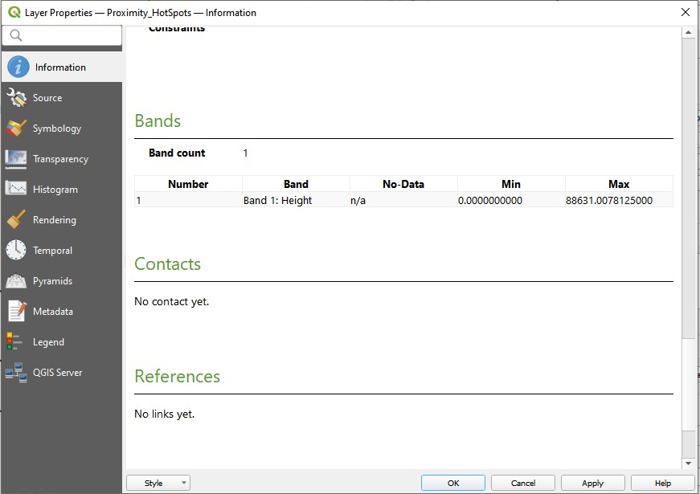
For Proximity_Hotspot, the maximum is **88631.007812500** while the minimum is **0**.
Next, at the Search pane of Geoprocessing Toolbox, panel, type **raster calculator**. We will be utilizing the **Raster Calculator of Raster Analysis**.
Double-click on it. The dialog window of the Raster calculator appears. At the layers panel, double click on Proximity_HotSpot layer. Under the Expression, fill up the **standardizing formula**. Choose Proximity_Hotspot as the Reference layer and it should look something like this. 

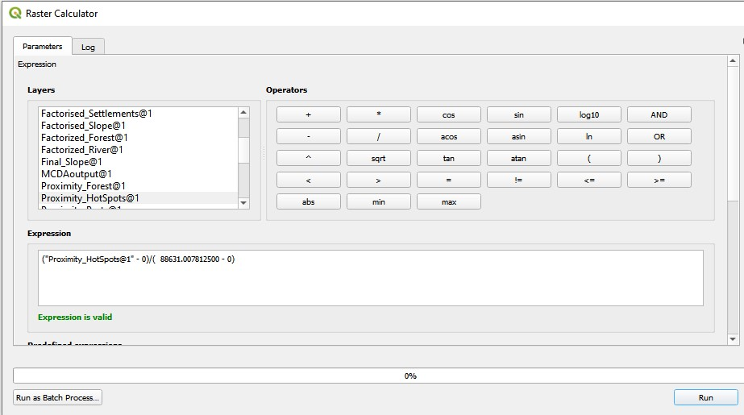

Click Run. Once the output is finished, save the layer as into the kalimantan geopackage and name it Factorised_HotSpot.

Repeat these steps for all the factors.

## 3.1 AHP Analysis
Using the excel sheet provided by SBC Associates, list down all the 7 different factors on the rows. We have determined the importance of each factor according to the rating on the left side of the excel sheet as seen here.


Ensure that the consistency check is below 10% for it to be a good evaluation.

Now, we will compute the Land Suitability Layer by using the factor score derived above. Using the raster calculator of QGIS, we will be using this expression:

> "Factorised_Slope@1" * 0.247  + "Factorised_HotSpot@1" * 0.221 + "Factorized_River@1" * 0.192 + "Factorized_Forest@1"*0.115 + "Factorised_Road@1"* 0.083+"Factorised_Port@1"* 0.071  +"Factor_major_settlement

Click on run. A new recalculated raster layer is created. Export and save this into the kalimantan geopackage, name it AHP_suitability. Ensure that the CRS is set to **EPSG:23845 - DGN95 / Indonesia TM-3 zone 54.1** before saving.

# 4.0 Identifying suitable sites
Once the MCDA model is done, we used a **composite factor score of at least 0.55** to evaluate site suitability, based on our current raster band.To do this, we will open up **Toolbox ->Search for Reclassify by table**. 


Click on the 3 dots next to Reclassification table.

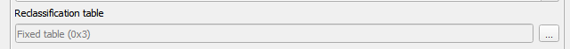

Click on **Add Row** **twice** then fill up the table as shown below then click OK.


Ensure that the **output data type** is **Float32**. Click on run.

The MCDA model should look something like this:

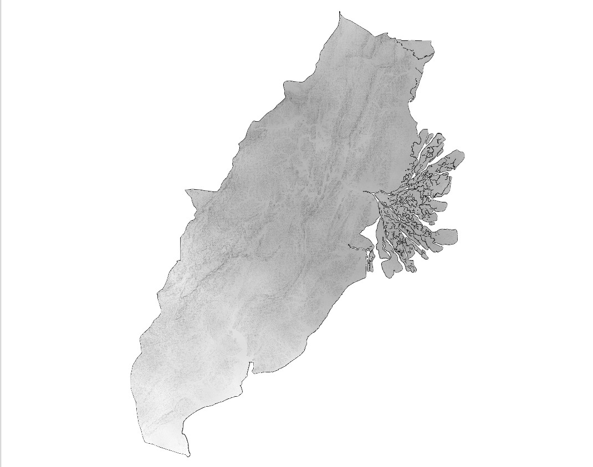

We will then save it as MCDA_model into the kalimantan geopackage. Ensure that the CRS is set to **EPSG:23845 - DGN95 / Indonesia TM-3 zone 54.1** before saving.

## 4.1 Vectorise suitable sites
From the menu bar, select **Raster -> Conversion -> Polygonize(Raster to Vector)**. Use the following parameters:

* **Input Layer**: AHP_capitalcity
* **Name of the field to create**: Sites.
* Ensure that **Use 8-connectedness** is **unchecked**.

Click on run.
A new temporary layer called Vectorized will be added as shown below.

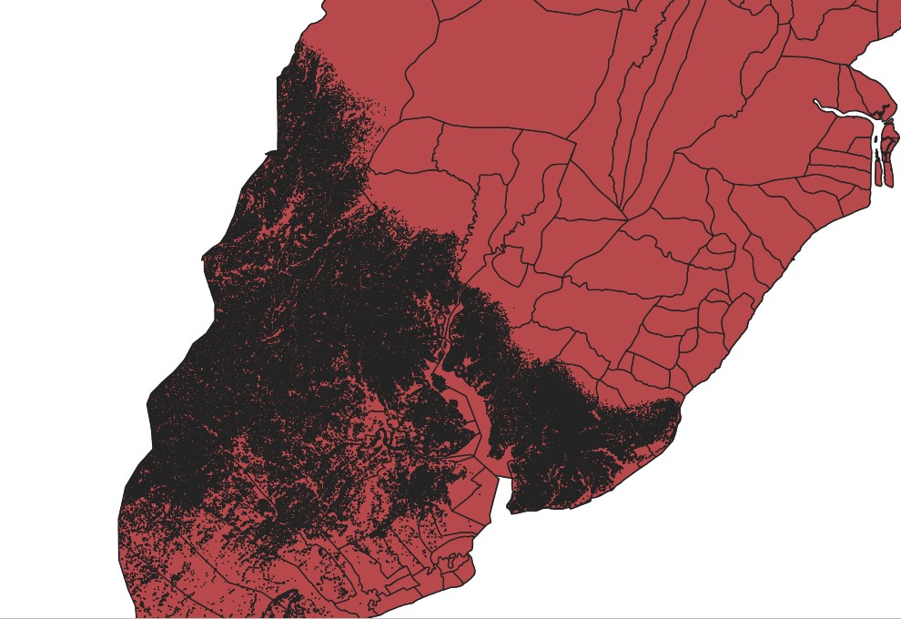

Only sites which are given the value of 1 in the attribute table on this layer are considered suitable. Right click on the layer and select **Attribute Table > Select by Expression** write **“Sites” = 1** as shown below.

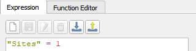

Click **Select features**. Then right click on the layer again. Select **Export  > Save selected features as** and save this into the kalimantan geopackage, naming it Vectoriesed_SelectedFeature.

The newly saved layer should look like this:

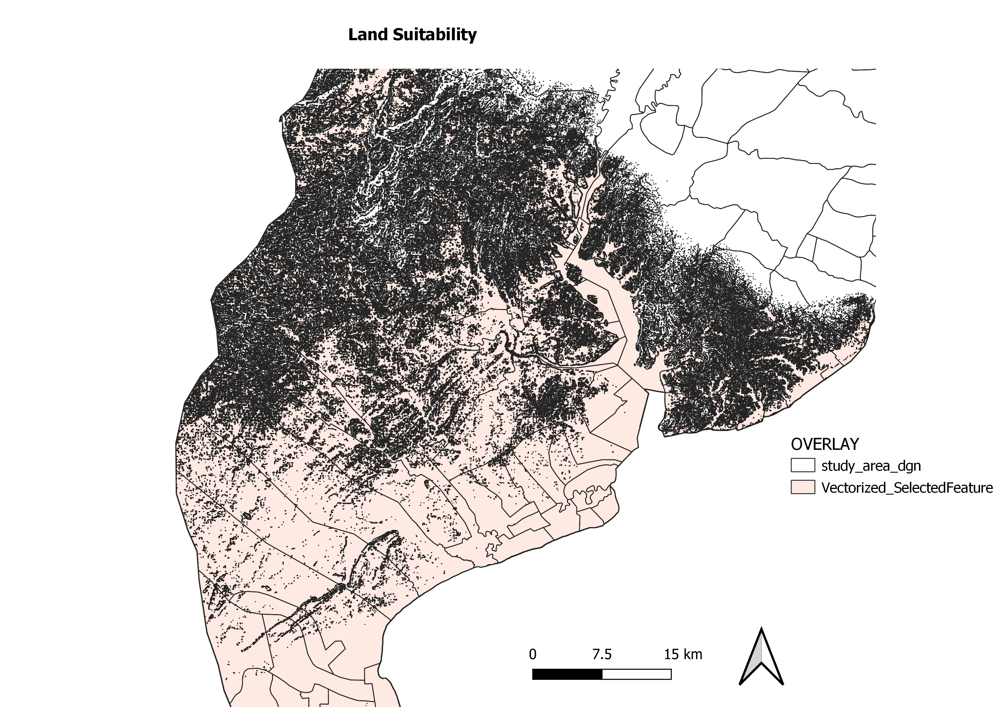

# 5.0 Site Suitability Analysis

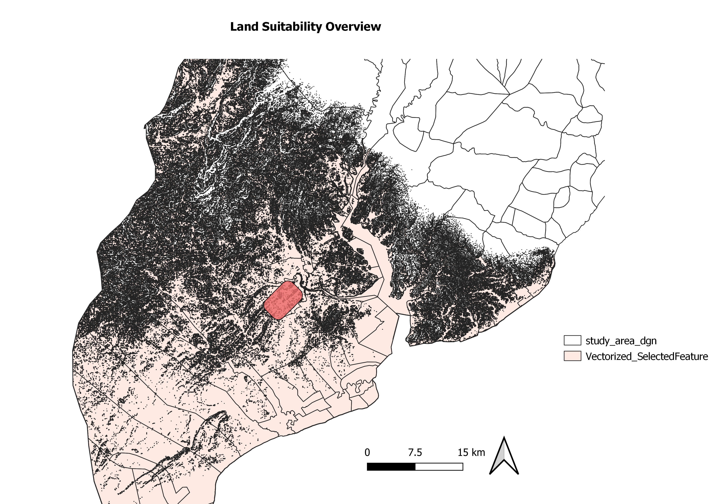

After much consideration and discussion, we have decided to propose for the new capital city to be in this area of East Kalimantan. After taking into consideration all factors. The reason why it looks like it is so spotty is because of the slope factor, which we gave the highest importance to. Since building a new capital city will be so costly, we decided to choose this spot as it is one of the areas that have the most level ground relative to the other suitable areas of the study area. The rectangle, which is the estimated size of the proposed city area, is around 4726 hectares.

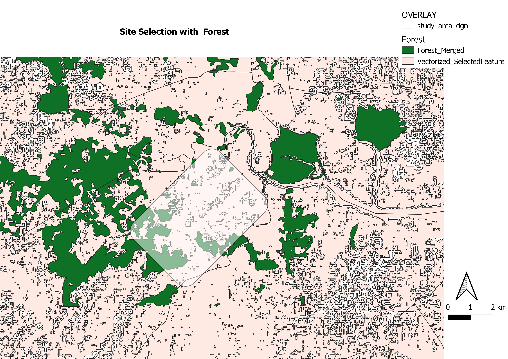

As observed, there are a few large forested areas around our proposed site selection. However, there is not a large area that will be needed to be deforested to make way for the new city. There are also many advantages of having a large forested area near a city as it brings around a lot of cooling effects. 

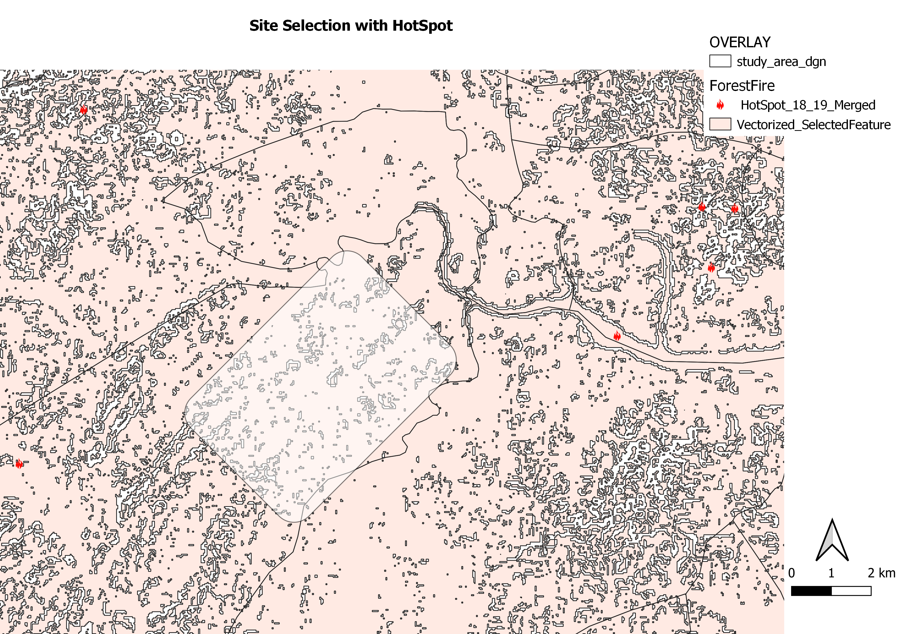

The proposed site is generally far away from all the hotspots that happened around the area in 2018 and 2019. 

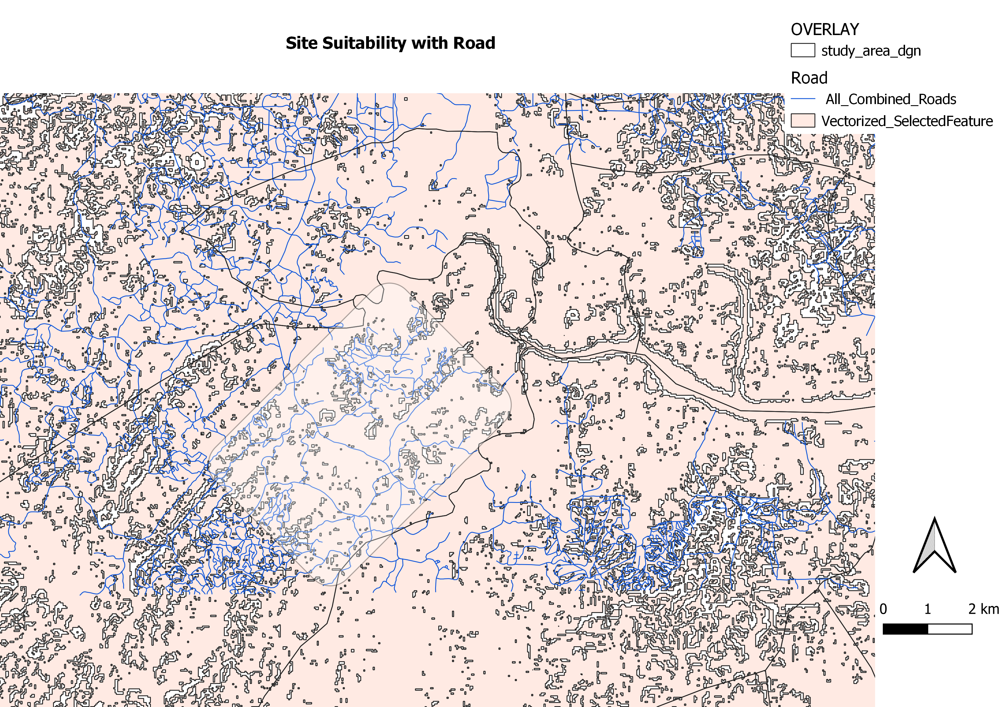

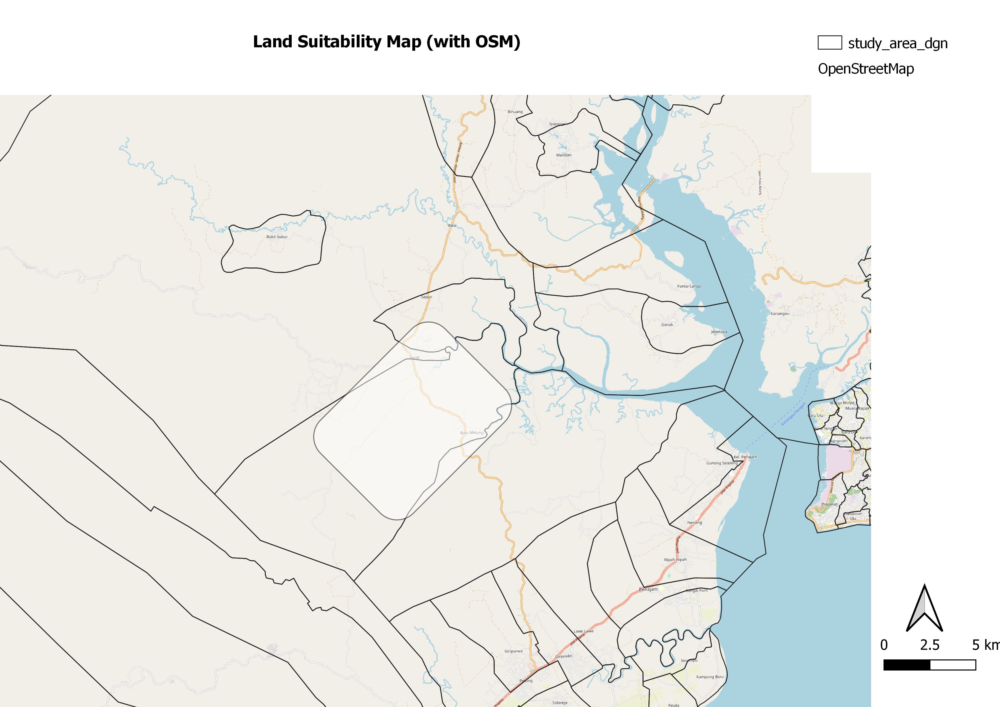

It can be seen that the capital city is definitely accessible by the roads (blue in colour). From the map with the OSM layer, the yellow line is a major roadway then goes across the major rivers and to the airports and Balikpapan’s major urban settlement. This makes the capital highly accessible as it is near the major roadway that essentially spans across the entire East Kalimantan. The proposed city, while near small rivers are not near any major river. Having rivers near the city is beneficial because it brings in economic benefits such as tourism, boating as well as fishing.

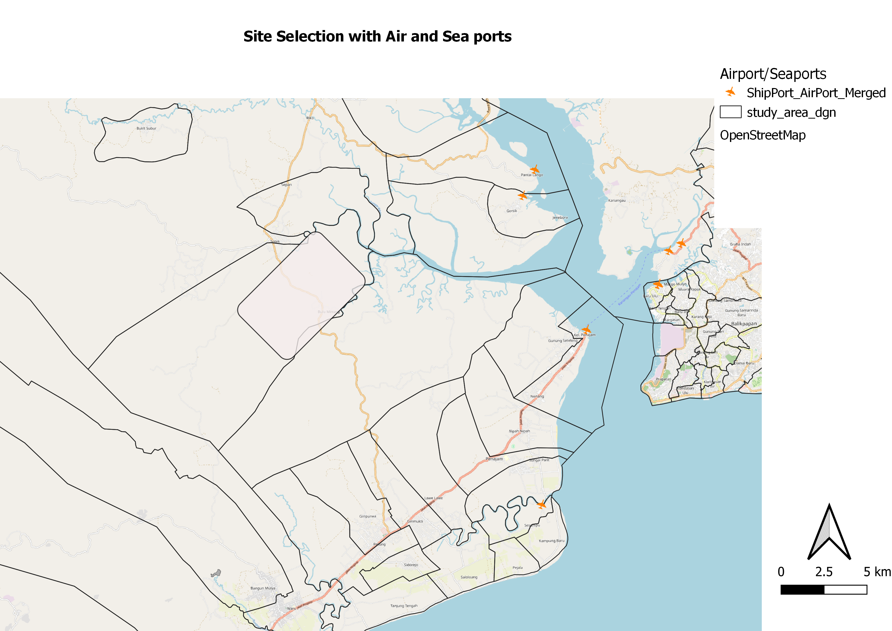

The map above shows how there are 2 ports, north of the proposed city location as well as 2 on the east side of it. It is very accessible to all the 4 ports near it. The major freeway (in yellow) actually passes through the capital city. It also goes across the major river towards the airport. While it is not very convenient, having a major freeway to bring you directly to the airport is considered accessible. Additionally, having an airport very close to you is also not good. It disrupts education as well as has long term side effects. It also over long periods of time, makes buildings weaker. Given that this was a multi-criteria decision analysis, this was the best area for a capital city. 

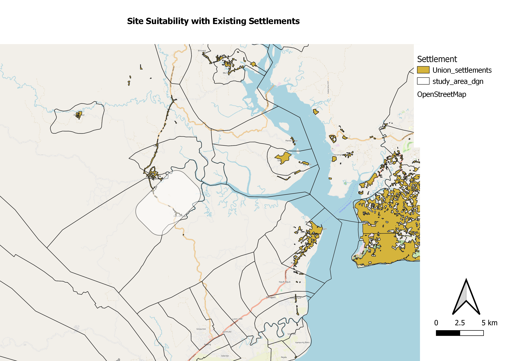

The map shows some of the existing settlements around the proposed area. It is good that while it is not near a current major urban settlement at Balikpapan, there are a few other small settlements around it. Having some settlements around the area is beneficial for those living there as it will improve their quality of life. They will have more job opportunities as well as an opportunity to sell the land their homes are on for companies to build urban homes for a very large profit. This is because the value of land increases tremendously when there are major projects in the nearby areas. This way, they will have an increased quality of life since their wealth has also increased tremendously.