```{r setup, include=FALSE}
knitr::opts_chunk$set(echo = TRUE)
```

# 1.0 Population and Demographic
Two choropleth maps are generated:

* General Population
* Working Population

Right click on the **Study_Area_dgn** and select Duplicate Layer. Rename these two layers into **Population** and **Work_Pop** respectively. 

## 1.1 General Population Choropleth Map

For Population layer, right click on the layer and select **Properties… > Symbology**. Change the **symbol type** from **Simple Symbol** to **Graduated** then under value select **Jumlah_Pen** which is the population data. 

Select **Blues** under colour ramp then select **Classify > Equal Count (Quantile)** to see the Classes box get populated. After that click Apply > OK to get the choropleth map of the general population of the study area. The map should look something like this:

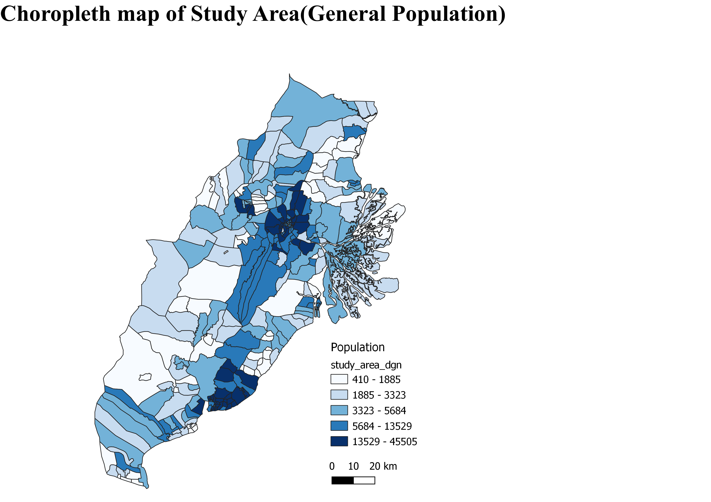

### 1.1.1 Analysis
From the choropleth map above, the general population density of East Kalimantan matches more urbanised areas, being much denser in mainly the two cities Kota Balikpapan and Samarinda, not just at the city centres but in nearby desa (sub-districts) around the cities. There is also a relatively high population density in the Penajam Paser Utara regency, corresponding to the settlement there.

## 1.2 Working Population Choropleth Map

For Work_Pop first right click on the layer and go to **Attribute Table** then click **Edit > Open Field Calculator**.


In Indonesia the working population is from age **20 to 65** so we shall use those data points from the attribute to create a new row. Enter **Work_Pop** into the output field name and select the following data points from **Fields and Values** to create the expression below before pressing OK.

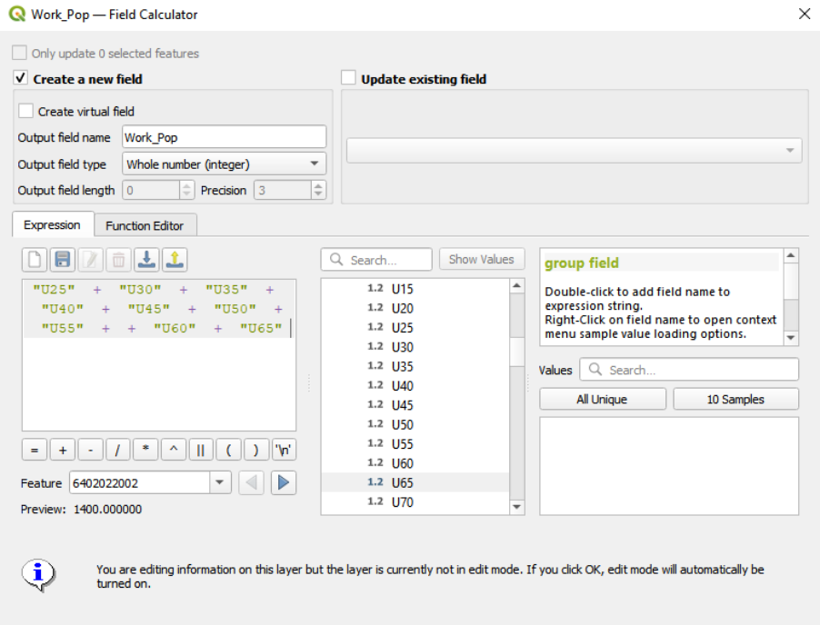

After that follow similar steps as the Population layer but when selecting the value in **symbology**, select **Work_pop** instead and continue to follow the steps to generate the choropleth map.

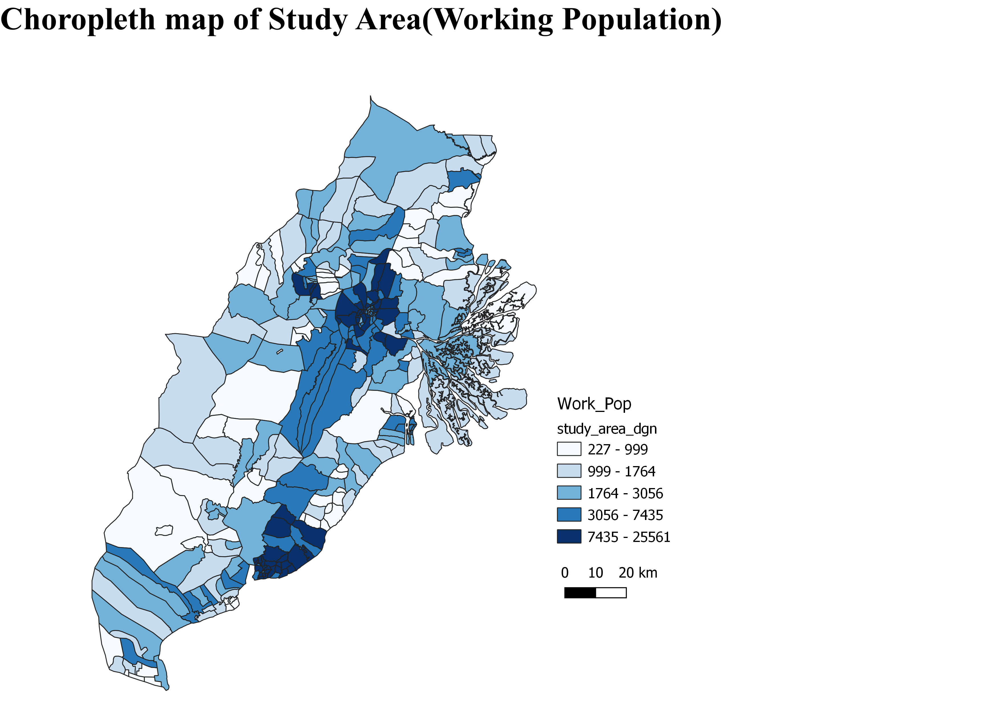

### 1.2.1 Analysis
From the choropleth map generated above, it is clear that similar to the general population, the majority of the working population in East Kalimantan mainly reside in the Kota Balikpapan and Samarinda cities. From the legend we can also see that the working population is generally around half the total population in each area.

## 1.3 Saving maps

To create a map layout, click on **Project > Layout Manager > Create**. Then name the map accordingly. After that hover over **Add Items** then add **Scale Bar, Label, Map and Legend**.

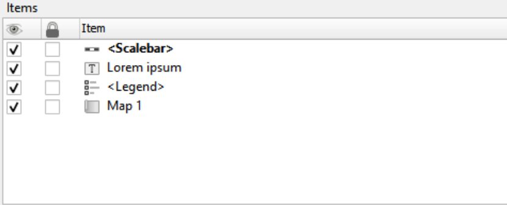

After this select **Layout > Export as Image > Save** to save the map as a file on your computer.

# 2.0 Economic and Businesses
A total of 3 maps will be created for economic and business:

* Healthcare Services
* Education
* Government buildings and others

First, create a new group on the left under the layer column, this is to create a neater workspace. Right click on the Layers column and select Create new group.

Next, using the layers related to Economic and Businesses mentioned in our data preparations, categorise the layers into **Healthcare Services**, **Government and Industry** as well as **Education Services**. Use these three categories along with **Study_Area_dgn** and **OpenStreetMap** to create their respective maps. Right click on Study_Area_dgn and then click on **Properties > Symbology > Simple Fill**. Then under **Fill Style**, choose **No Brush**. This will make the map transparent to allow you to see the other layers more clearly. After this you can proceed to save the maps using **Layout Manager**.


## 2.1 Healthcare services

.png)

From the map generated above we can see the health services are clustered around Kota Balikpapan and Samarinda cities. This is also where the majority of the total population in the study area reside so there is justification in the clusters.

## 2.2 Education

.png)

From the map generated above we can see the education services are clustered around Kota Balikpapan and Samarinda cities. This is also where the majority of the total population in the study area reside so there is justification in the clusters. 

## 2.3 Government Buildings and others

.png)

From the map generated above we can see the government buildings are clustered around Kota Balikpapan and Samarinda cities. This is also where the majority of the total population in the study area reside so there is justification in the clusters. 

# 3.0 Transport and Communication
There are 2 maps in this section:

* Transport
* communication

## 3.1 Layer union
First separate the data mentioned in the dataset into two categories, Transport Infrastructure and Communications respectively. Using all of the **Street_LN** layers, select **Vector > Geoprocessing Tools > Union**. Select the required layers to combine all the streets together. After each combination, use Union again with the created layer and another **Street_LN layer**. The first step is shown below.

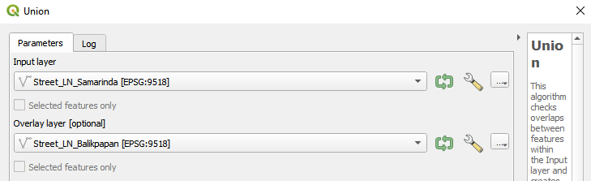

Following this, continue to follow the steps detailed in the first map by adding the required layers in order to get the **Transport Infrastructure** map.

For the **Communications map**, add in the required layers as well similar to the previous maps then save both maps using the **Layout Manager** function.

## 3.2 Transport

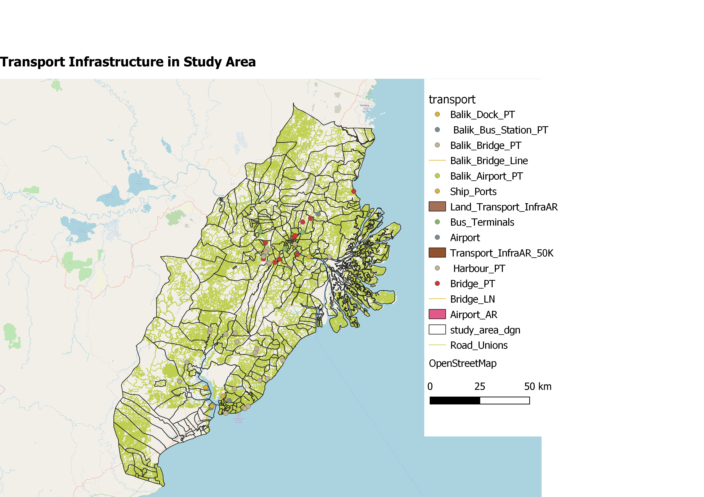

Transport systems in the study area consist of road networks as well as infrastructure that enable travel such as harbours, bus terminals and airports. The road networks cover the majority of the study area while the infrastructure is concentrated around Kota Balikpapan and Samarinda cities. This reflects current world affairs where Balikpapan is known for being a port city. 

## 3.3 Communication

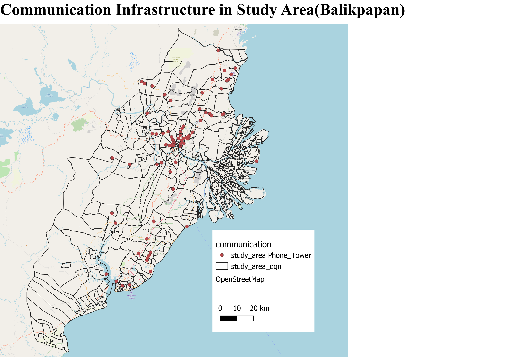

For communication systems we have decided to only include phone towers. There is heavy concentration of such infrastructure around Samarinda with others spread around the rest of the study area. Besides Kota Balikpapan and Samarinda Cities, the infrastructure does not correlate to the general population in the study area.

# 4.0 Infrastructure
For infrastructure, there are a total of 10 maps, separated by their regency. These are:

* Kota Balikpapan
* Kutai Kartanegara
* Penajam Paser Utara
* Kota Samarinda

Similar to the previous maps, separate the points in the Infrastructure dataset by location as well as roads and their respective buildings to be used. After that add them to their respective maps. Follow the steps above in order to create each map and then save them using the **Layout Manager**.

## 4.1 Kota Balikpapan

.png)

General map of all infrastructure in Balikpapan. 

 (Balik).png)

With removal of the road line, the map becomes a lot cleaner and easier for analysis. We can see a concentration of infrastructure around Kota Balikpapan but at the same time we also see multiple infrastructures closely following the runway line in the area as well as other major roads highlighted by the open street map.  

 Roadline.png)

## 4.2 Kutai Kartanegara

.png)

This map shows the locations of the existing settlements in the district of Kutai Kartanegara. It is rather obvious that the settlements are mostly in the port city of Kota Balikpapan as well as the mining city of Samarinda. There is an abundance of job opportunities here compared to the other areas in East Kalimantan. 

.png)

## 4.3 Penajam Paser Utara

Roads.png)

General infrastructure of land roads in Penajam Paser Utara.

Others.png)

This map shows the existing settlement in Penajam Paser Utara. The settlement can be considered a self-reliant community because it has the basic infrastructure to support itself such as a gas station, a post office, government offices, tv transmitter towers, worship places as well as hospitals. There are enough amenities for the settlement to be self-sustaining.

## 4.4 Kota Samarinda

.png)

(Other Buildings).png)

For a city to run efficiently, it has to have some important buildings in it. For example, in Samarinda, there is a post office, a radio station, tv station as well as terminals for buses. There are also bridges and airport runways to connect the city with the rest of the world. For a country like Indonesia where natural disasters quite frequently, it is vital to have a radio station to relay important information to citizens in the event of an emergency, when cell phones and electrical as well as network towers are deemed useless.  

(Worship).png)

Generally, from the map generated, the worship locations are quite clustered in the city of Samarinda. With most of the population being Malay-Muslims, most of these points are mosques, while the rest of the locations are mostly churches and Buddhist temples. With more than 230 out of 284 worship places being Mosques, it puts into perspective the high proportion of Muslims in the population. 

# 5.0 Environment and Hazards
For environment and hazards, there are a total of 8 maps separated by regency. These are:

* Kota Balikpapan
* Kutai Kartanegara
* Penajam Paser Utara
* Kota Samarinda

For Environments and Hazards, separate the data by location as well as into categories such as **water hazards**, **natural and land hazards** and **below sea level respectively**. From here follow the steps mentioned before to populate the maps with their respective data points then save the maps using **Layout Manager**.

## 5.1 Kota Balikpapan

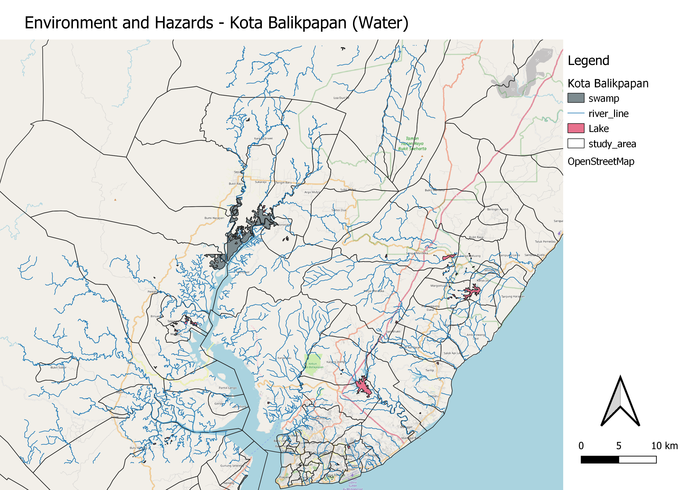

For Kota Balikpapan, it can be seen that there is an extensive river system that runs throughout the regency, leading to the ocean. There are a few small lakes spread across the regency, as well as one major swamp area northwest from the city.

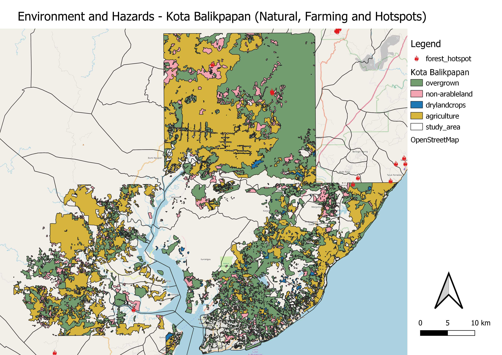

Most of the agricultural areas lie relatively far away from the city centre, mainly along the coast in the outer settlements and north of the city. Additionally, there is very little non-arable land in this regency, but most of the land constitutes to overgrown vegetation, even within the city itself.


## 5.2 Kutai Kartanegara

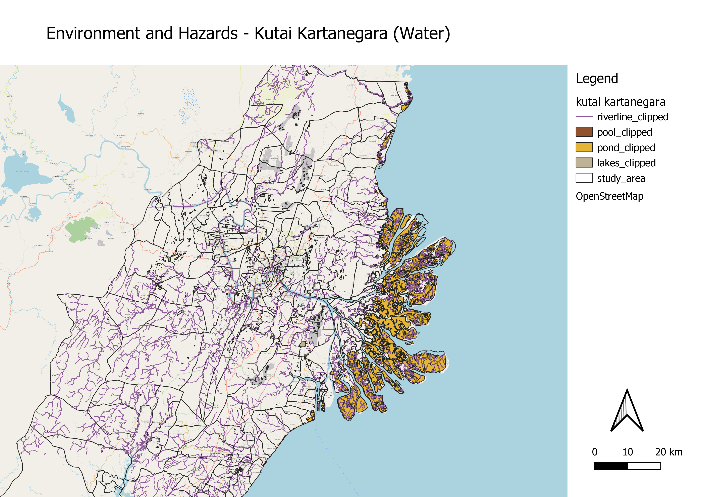

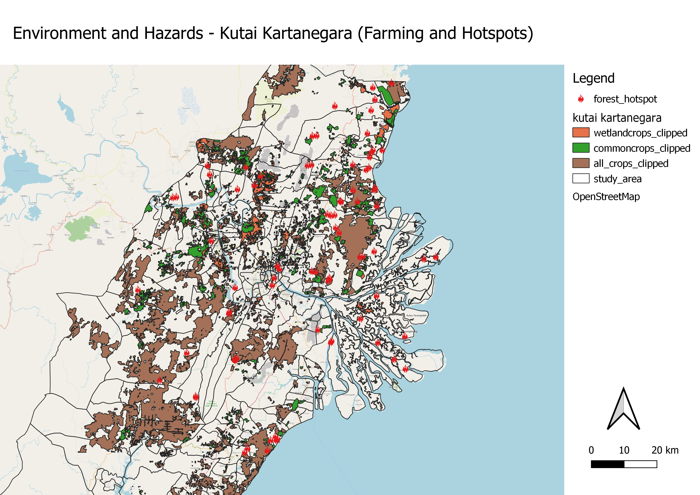

The map above shows the locations of arable land where farming is occurring in East Kalimantan, specifically, Kutai Kartanegara. With so much land dedicated to agriculture, it is essential that these arable lands are left untouched in order for there to be food security for the people living in the nearby regions. In a recent paper[1], it shows how 82.28% of villages in Kutai Kartanegara are food secure. A new capital city, in order to be a good one needs to have a strong network for food resources. 

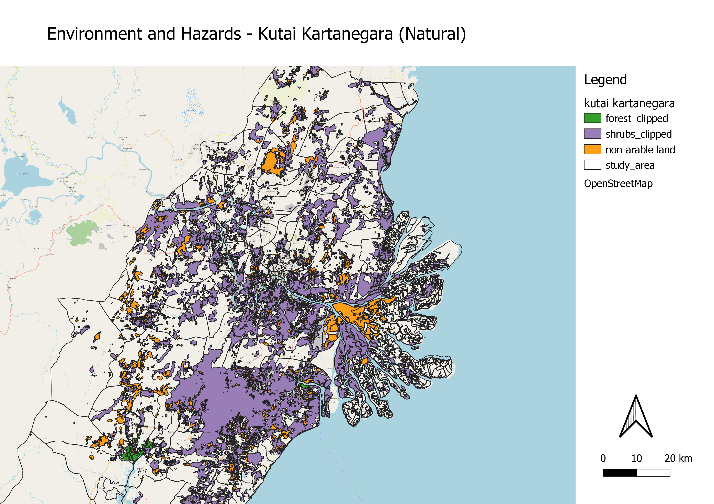
The layer “shrubs_clipped” actually displays the areas of Kutai Kartanegara where there is dense vegetation [2].  With a lot of corruption, involvement of political agenda and the creation of the North Kalimantan province, the percentage of forested area has dropped from 35% to 15% of the total area in the province. The capital cannot be built on top of dense forests but should also be in the range of some. Forests are in fact essential within cities, they reduce urban temperature, purify the air and provide habitats for local wildlife [3]. Forests in the vicinity also prevent flooding, which is especially important considering that being the primary reason for the new capital selection.

## 5.3 Penajam Paser Utara

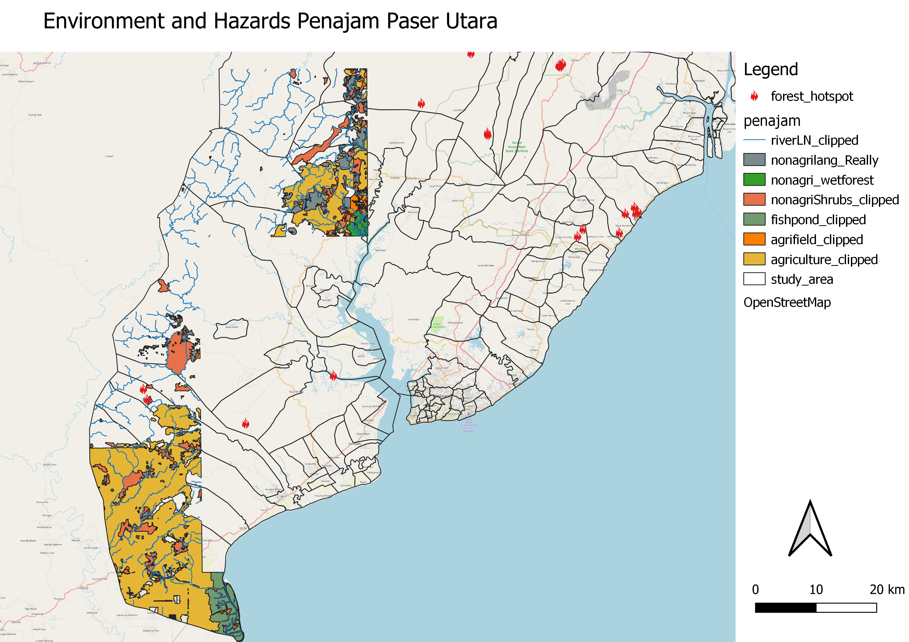
Generally, of the districts and sub-districts of Penajam Paser Utara regency within the study area, most of the agriculture is done near the settlement in the bottom left of the study area. As we go further up north, there are fewer agricultural areas, being replaced with more rivers and natural forests and shrubs.

## 5.4 Kota Samarinda


As for Samarinda, one of the main defining features of this regency is the Mahakam River, the second longest river in Indonesia that runs through the port city of Samarinda[4]. The river itself is surrounded by large areas of dry vegetation as well as non-arable land. The river remains an important part of the ecosystem and economy of Samarinda, supporting many different endemic and protected species, as well as providing river transportation for commercial activities. 

However, due to the extensive coal mining operations and deforestation carried out along the river, it has become highly polluted. Furthermore, as deforestation and coal mining have loosen the soil around the river and caused erosion, there has been a drastic increase in the number of floods around the river and into the city itself, disrupting economic activities and destroying commercial and residential infrastructure, affecting up to 50,000 people a year, with up to 5 to 6 floods a year.

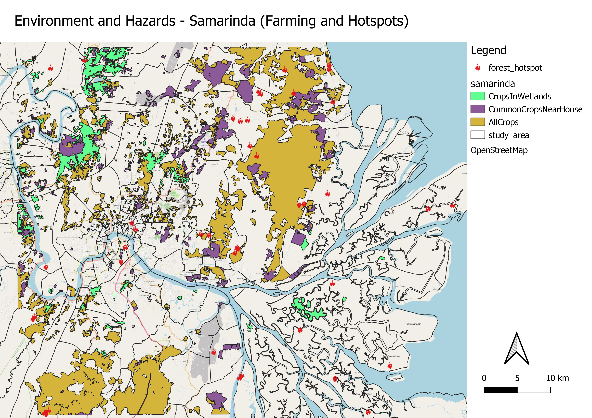

For agriculture in Samarinda, most of it lies far from the city centre and away from the Mahakam River, likely due to concerns from floods.


This map that indicates the areas of East Kalimantan that are below mean sea level is an important factor because of the location of Indonesia as a whole [5]. Indonesia sits along the “Pacific Ring of Fire”. This actually means that Indonesia is at a location where several tectonic plates meet and converge. When tectonic plates converge, it results in the formation of earthquakes which often trigger tsunamis. Thus, it is important to note that these places are at risk areas because with global warming, mean sea level is slowly rising.

# 6.0 References
[1] https://www.researchgate.net/publication/322015716_Food_insecurity_as_a_basis_for_drafting_a_Strategic_Food_Sovereignty_Plan_A_case_study_of_the_Kutai_Kartanegara_District_Indonesia

[2] https://news.mongabay.com/2013/02/indonesias-east-kalimantan-loses-forest-area-to-new-province-in-borneo/

[3] https://cities4forests.com/forests/#:~:text=Trees%20and%20forests%20are%20essential%20to%20cities%20and%20their%20residents.&text=Trees%20and%20natural%20areas%20within,and%20provide%20habitat%20for%20wildlife.

[4] https://globalwaterforum.org/2020/10/23/the-story-of-mahakam-river-in-indonesia-from-the-commons-to-extractivism-and-back/

[5] https://www.nationalgeographic.org/encyclopedia/ring-fire/
